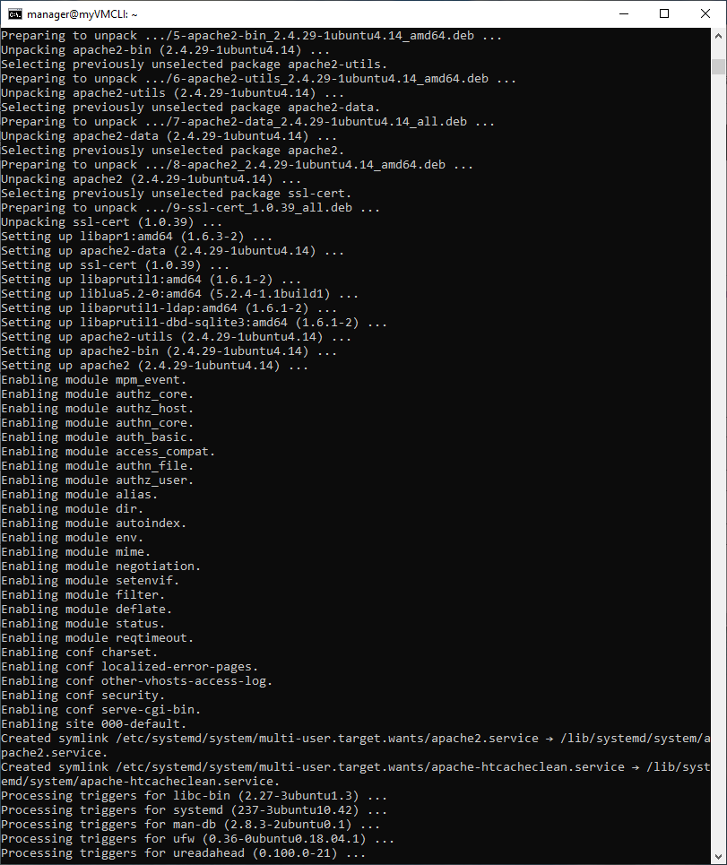

JOSE VICENTE TEJERO CALDERERA - 19/11/2020

## Creacion de la maquina virtual en Azure Cli

### Conectarse desde Azure Cli A Azure

```
az login
```


### Creando un grupo de recursos

```
az group create -l EastUS -n myRGCLI 
```


### Creando una máquina virtual Linux

```
az vm create ^
 --name myVMCLI ^
 --resource-group myRGCLI ^
 --image UbuntuLTS ^
 --location EastUS ^
 --admin-username azureuser ^
 --admin-password Pa$$w0rd1234 ^
 --no-wait
```


Conectarse a la máquina Virtual de Linux

```
ssh azureuser@104.211.52.252
Nota: Dar que si en la creación del certificado SSH
```

ssh manager@52.146.38.240

Password12345678


1 - Actualizar en Linux

```
sudo apt-get update
```


2 - Hacer el upgrade

```
sudo apt upgrade
```


3 - Instalar un servidor web

```
sudo apt install -y apache2 apache2-utils
```




4 - Vemos el estatus de Apache

```
systemctl status apache2
```


5 - Ponemos un mensaje en nuestra página de Apache

```
cd /var/www/html
```

6 - Poner una nota en la página index.html

```
sudo vi index.html <ENTER>
<ESC> : 198 <ENTER> // irme a la linea 198 que es donde esta el mensaje de index.html
<i> PONER EL MENSAJE <ESC>
: x <ENTER>

```


7 - Salir del SSH

```
exit <ENTER>
```


**Nota:**

El puerto 80 deberá ser abierto desde NSG.

Destination PortRanges: 80

Name: Port_80


Probariamos que llegamos a la maquina virtual: con la IP desde cualquier navegador.


## Parar y "deallocate" la máquina virtual

```
az vm stop --resource-group myRGCLI --name myVMCLI --no-wait
```

```
az vm deallocate -g myRGCLI -n myVMCLI --no-wait
```

## Iniciar la máquina virtual

```
az vm start -g myRGCLI -n myVMCLI --no-wait
```

## Borrar la máquina virtual

```
az vm delete -g myRGCLI -n myVMCLI --yes --no-wait
```

### Mostrar informacion de la máquina virtual

```
az vm show -g myRGCLI -n myVMCLI -d
```

Borrar el grupo de recursos

```
az group delete -n myRGCLI  --yes --no-wait
```

## Desconectamos de Azure

```
az logout
```

Mas información:

[Manage Linux or Windows virtual machines.](https://docs.microsoft.com/en-us/cli/azure/vm?view=azure-cli-latest)

